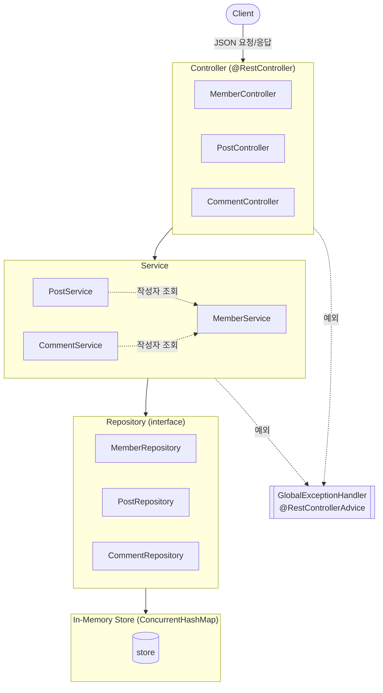
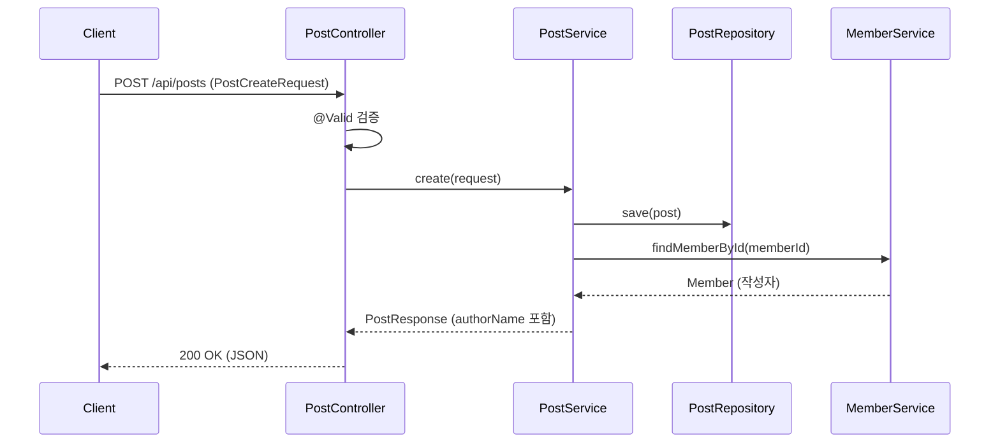
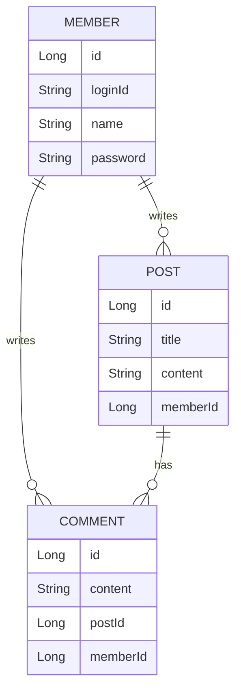

# CRUD 게시판 REST API

Spring Boot 기반 REST API 학습 프로젝트입니다.
회원 / 게시글 / 댓글의 CRUD를 구현하며, **순수 자바(메모리 저장소)로 먼저 구현한 뒤 단계적으로 실무 요소를 얹어가는 것**을 목표로 합니다.

## 학습 목표

- REST API 설계 및 구현 (`@RestController`, `@RequestBody`, DTO)
- 계층형 아키텍처 (Controller → Service → Repository)
- 도메인 간 연관관계 처리 (게시글·댓글의 작성자 조회)
- 단위 테스트 + API 통합 테스트 (JUnit5, AssertJ, RestClient)
- **[예정] JdbcTemplate → JPA 전환** — 메모리 저장소를 실제 DB로 전환하며 SQL·연관관계·영속성 학습

## 기술 스택

| 구분 | 내용 |
|---|---|
| Language | Java 21 |
| Framework | Spring Boot 4.1.0 |
| Build | Gradle |
| Test | JUnit5, AssertJ, RestClient |
| 저장소 | 인메모리 (`ConcurrentHashMap`) — *DB 전환 예정* |

## 시스템 아키텍처

### 계층 구조



- Controller는 요청/응답만, 비즈니스 로직은 Service, 데이터 접근은 Repository가 담당
- `PostService`·`CommentService`는 작성자 이름을 얻기 위해 `MemberService`를 참조
- 모든 예외는 `GlobalExceptionHandler`가 가로채 일관된 형식(`ErrorResponse`)으로 응답

### 요청 처리 흐름 (게시글 생성)



### 도메인 관계



- 연관관계는 현재 **id 참조**(`memberId`, `postId`)로 표현
- JPA 전환 시 객체 참조(`@ManyToOne`)로 변경 예정

## API

### 회원
| Method | URL | 설명 |
|---|---|---|
| POST | `/api/members` | 회원 생성 |
| GET | `/api/members` | 회원 목록 |
| GET | `/api/members/{id}` | 회원 단건 조회 |

### 게시글
| Method | URL | 설명 |
|---|---|---|
| POST | `/api/posts` | 게시글 생성 |
| GET | `/api/posts` | 게시글 목록 |
| GET | `/api/posts/{id}` | 게시글 단건 조회 |

### 댓글
| Method | URL | 설명 |
|---|---|---|
| POST | `/api/comments` | 댓글 생성 |
| GET | `/api/comments` | 댓글 목록 |
| GET | `/api/comments/{id}` | 댓글 단건 조회 |

> 게시글·댓글 응답에는 작성자 이름(`authorName`)이 포함됩니다. (memberId로 회원을 조회해 조립)

## 설계 포인트

- **DTO 분리**: 요청(`XxxCreateRequest`) / 응답(`XxxResponse`)을 도메인과 분리. 응답에서 비밀번호 등 민감 정보 제외.
- **Repository 인터페이스화**: 구현체(`XxxRepositoryImpl`)를 분리해 DB 전환 시 교체가 용이하도록 설계.
- **도메인 불변성**: `@Setter` 대신 생성자·의미 있는 메서드(`assignId`)로 상태 변경.
- **Optional**: 단건 조회는 `Optional` 반환, 없으면 예외 처리.
- **정적 팩토리 메서드**: 응답 DTO는 `of()`로 생성.
- **계층 책임 분리**: 내부 로직용 도메인 반환(`findMemberById`)과 API용 DTO 반환(`findOne`)을 구분.

## 테스트

```bash
./gradlew test
```

| 종류 | 내용 |
|---|---|
| **Service 단위 테스트** | 로직 검증. 성공·실패(예외)·연관관계(작성자 이름) |
| **API 통합 테스트** | `@SpringBootTest(RANDOM_PORT)` + RestClient로 실제 HTTP 요청 전 구간 검증 |

## 실행

```bash
./gradlew bootRun
```

## 로드맵

### 완료
- [x] 도메인 · Repository (메모리)
- [x] REST API (Member / Post / Comment)
- [x] Service 단위 테스트
- [x] API 통합 테스트 (RestClient)

### 진행 예정

**1. REST API 완성도**
- [ ] 전역 예외 처리 (`@RestControllerAdvice`) — 예외를 상황에 맞는 상태 코드(404 등)와 일관된 에러 응답으로 변환
- [ ] 입력 검증 (`@Valid` + Bean Validation)
- [ ] 상태 코드 정리 (`ResponseEntity` — 생성 201, 삭제 204)

**2. DB 전환**
- [ ] JdbcTemplate + H2 (SQL 직접 작성)
- [ ] JPA 전환 (연관관계 매핑, 삭제 정책/cascade)
- [ ] 트랜잭션 (`@Transactional`)

**3. 실전 기능**
- [ ] 페이징 조회
- [ ] 로그인 · 인증 (JWT)
- [ ] API 문서화 (Swagger)
