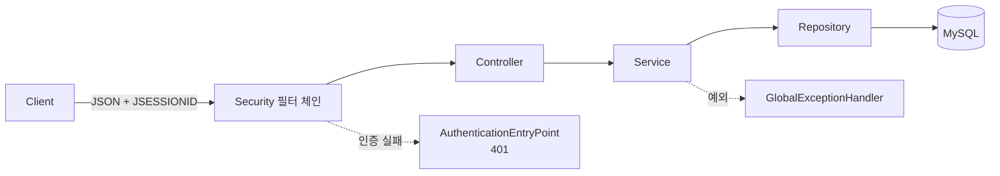
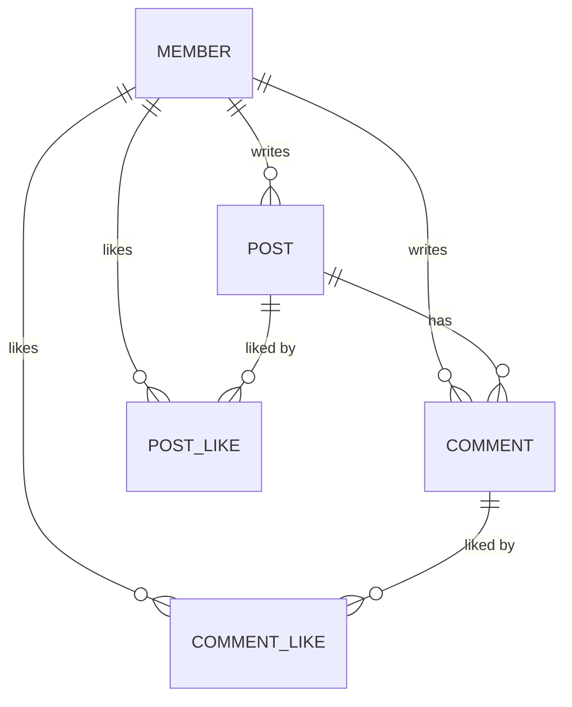

# CRUD 게시판 REST API

회원 / 게시글 / 댓글 / 좋아요 기능을 갖춘 Spring Boot 학습 프로젝트입니다.
먼저 메모리 저장소로 CRUD를 구현하고 **DB 접근 기술을 단계적으로 교체(메모리 → MyBatis → JPA)** 하며 각 기술의 차이를 익혔습니다. 지금은 여기에 기능을 붙이면서 마주치는 **JPA 성능·동시성 문제를 직접 측정하고 해결**하는 쪽으로 넓혀가고 있습니다.

**학습 회고 (velog)**
> - [MyBatis에서 JPA로: 연관관계 도입과 지연로딩](https://velog.io/@ochhs0829/MyBatis%EC%97%90%EC%84%9C-JPA%EB%A1%9C-%EB%A7%88%EC%9D%B4%EA%B7%B8%EB%A0%88%EC%9D%B4%EC%85%98)
> - [N+1 쿼리 6번을 1번으로: Fetch Join · @EntityGraph · Batch Size](https://velog.io/@ochhs0829/N1-%EB%AC%B8%EC%A0%9C-%EC%8B%A4%EC%B8%A1%EA%B3%BC-%ED%95%B4%EA%B2%B0)
> - [N+1 해결책 트레이드오프: 조인 종류, 페이징, 연관관계별 선택](https://velog.io/@ochhs0829/N1-%ED%95%B4%EA%B2%B0%EC%B1%85-%ED%8A%B8%EB%A0%88%EC%9D%B4%EB%93%9C%EC%98%A4%ED%94%84)
> - [게시판 좋아요 설계: 별도 테이블과 COUNT 조회](https://velog.io/@ochhs0829/%EA%B2%8C%EC%8B%9C%ED%8C%90%EC%97%90-%EC%A2%8B%EC%95%84%EC%9A%94-%EA%B8%B0%EB%8A%A5-%EC%84%A4%EA%B3%84%ED%95%B4%EB%B3%B4%EA%B8%B0)
> - [테스트 공통 코드 추출과 그 비용: DRY보다 DAMP](https://velog.io/@ochhs0829/%EC%A4%91%EB%B3%B5-%EC%A0%9C%EA%B1%B0-%EA%B8%B0%EC%A4%80%EA%B3%BC-%ED%85%8C%EC%8A%A4%ED%8A%B8-%EA%B3%B5%ED%86%B5-%EC%BD%94%EB%93%9C-%EC%A0%95%EB%A6%AC)
> - [게시글 조회수 붙이기: 원자적 UPDATE와 readOnly 트랜잭션](https://velog.io/@ochhs0829/%EA%B2%8C%EC%8B%9C%EA%B8%80-%EC%A1%B0%ED%9A%8C%EC%88%98-%EB%B6%99%EC%9D%B4%EA%B8%B0-%EC%9B%90%EC%9E%90%EC%A0%81-UPDATE%EC%99%80-readOnly-%ED%8A%B8%EB%9E%9C%EC%9E%AD%EC%85%98)
> - [게시판에 로그인 붙이기: JWT 대신 세션을 고른 이유](https://velog.io/@ochhs0829/%EA%B2%8C%EC%8B%9C%ED%8C%90%EC%97%90-%EB%A1%9C%EA%B7%B8%EC%9D%B8-%EB%B6%99%EC%9D%B4%EA%B8%B0-JWT-%EB%8C%80%EC%8B%A0-%EC%84%B8%EC%85%98%EC%9D%84-%EA%B3%A0%EB%A5%B8-%EC%9D%B4%EC%9C%A0)

## 기술 스택

| 구분 | 내용 |
|---|---|
| Language | Java 21 |
| Framework | Spring Boot 3.4.5 |
| DB | MySQL 8.0 (Docker) |
| 접근 기술 | Spring Data JPA |
| 인증 | Spring Security (세션 기반) |
| Test | JUnit5, AssertJ, RestClient |
| Build | Gradle |

> MyBatis로 구현했던 버전은 [`mybatis` 브랜치](../../tree/mybatis)에 있습니다.
> 게시글–댓글을 `@OneToMany` 컬렉션으로 매핑했던 버전은 [`n-plus-1` 브랜치](../../tree/n-plus-1)에 있습니다. 2편·3편의 컬렉션 N+1과 `@BatchSize` 실측이 그 코드 기준입니다.

## 아키텍처

**계층별 책임**

| 계층 | 역할 |
|---|---|
| Security 필터 체인 | 세션에서 인증 정보 복원, 경로별 접근 제어 |
| Controller | 요청/응답 처리, `@Valid` 검증, 인증된 회원 id 추출 |
| Service | 비즈니스 로직, `@Transactional`, 작성자 조회 |
| Repository | 데이터 접근 (`JpaRepository`) |
| AuthenticationEntryPoint | 인증 실패(필터 단계) → 401 JSON |
| GlobalExceptionHandler | 전역 예외(컨트롤러 단계) → 일관된 에러 응답 |

> 인증 실패는 `DispatcherServlet`보다 앞인 필터에서 발생해 `@RestControllerAdvice`를 거치지 않습니다. 그래서 401만 별도 핸들러로 응답 형식을 맞춥니다.

> Repository를 인터페이스로 분리해, 구현체만 교체(메모리 → MyBatis → JPA)하면 상위 계층은 그대로 유지됩니다.

## 도메인 관계

- `Member` (1) ─ (N) `Post` ─ (N) `Comment`
- 댓글은 게시글을 `@ManyToOne`이 아니라 `Long postId`로 참조합니다. 댓글 서비스가 게시글 도메인을 몰라도 되고, 도메인 간 순환 의존이 생기지 않습니다
- 좋아요는 대상별로 테이블을 분리(`post_like` / `comment_like`)하고, 각각 단방향 `@ManyToOne` 두 개로 매핑
- `UNIQUE(post_id, member_id)` · `UNIQUE(comment_id, member_id)`로 중복 좋아요 방지
- `@ManyToOne`으로 객체 참조 매핑 (지연로딩)
- 비밀번호는 `DelegatingPasswordEncoder`로 해싱해 `{bcrypt}$2a$10$...` 형태로 저장합니다. 접두사가 알고리즘을 기록해 두므로 나중에 알고리즘을 바꿔도 기존 값을 그대로 검증할 수 있습니다

## API

| Method | URL | 설명 | 인증 |
|---|---|---|---|
| `POST` | `/api/members` | 회원 생성 | |
| `GET` | `/api/members` `/{id}` | 회원 목록 / 단건 | |
| `POST` | `/api/auth/login` | 로그인 | |
| `POST` | `/api/auth/logout` | 로그아웃 | 필요 |
| `GET` | `/api/auth/me` | 내 정보 | 필요 |
| `POST` | `/api/posts` | 게시글 생성 | 필요 |
| `PUT` | `/api/posts/{postId}` | 게시글 수정 (작성자만) | 필요 |
| `DELETE` | `/api/posts/{postId}` | 게시글 삭제 (작성자만) | 필요 |
| `GET` | `/api/posts` `/{id}` | 게시글 목록 / 단건 | |
| `POST` | `/api/comments` | 댓글 생성 | 필요 |
| `PUT` | `/api/comments/{commentId}` | 댓글 수정 (작성자만) | 필요 |
| `DELETE` | `/api/comments/{commentId}` | 댓글 삭제 (작성자만) | 필요 |
| `GET` | `/api/comments` `/{id}` | 댓글 목록 / 단건 | |
| `POST` | `/api/posts/{postId}/likes` | 게시글 좋아요 | 필요 |
| `DELETE` | `/api/posts/{postId}/likes` | 게시글 좋아요 취소 | 필요 |
| `GET` | `/api/posts/{postId}/likes/count` | 게시글 좋아요 수 | |
| `POST` | `/api/comments/{commentId}/likes` | 댓글 좋아요 | 필요 |
| `DELETE` | `/api/comments/{commentId}/likes` | 댓글 좋아요 취소 | 필요 |
| `GET` | `/api/comments/{commentId}/likes/count` | 댓글 좋아요 수 | |

> 읽기(`GET`)는 인증 없이 열려 있고, 쓰기는 로그인이 필요합니다. 회원 가입과 로그인만 예외입니다.
> 인증이 필요한 요청에 세션이 없으면 `401`과 `{"status":401,"message":"로그인이 필요합니다"}`가 나갑니다.
> 작성자가 아닌 회원이 수정을 시도하면 `403`이 나갑니다. 인증 실패(401)는 필터에서, 인가 실패(403)는 서비스에서 판단합니다.
> 게시글·댓글 삭제는 소프트 삭제입니다. `deleted_at`을 채우고 조회에서 제외하므로 삭제된 리소스는 `404`가 나갑니다. 게시글을 삭제하면 그 글의 댓글도 함께 제외됩니다.
> 게시글·댓글 응답에는 작성자 이름(`authorName`)이 포함됩니다.
> 좋아요 응답에는 갱신된 개수(`likeCount`)와 눌렀는지 여부(`liked`)가 포함됩니다.

## 설계 포인트

- **DTO 분리** — 요청/응답 DTO를 도메인과 분리, 응답에서 민감 정보(비밀번호) 제외
- **Repository 인터페이스화** — 구현체 교체로 DB 기술 전환 (메모리 → MyBatis → JPA)
- **도메인 불변성** — `@Setter` 대신 생성자·의미 있는 메서드 사용
- **전역 예외 처리** — `@RestControllerAdvice`로 404/400/409 등 일관된 에러 응답. 하부 기술 예외(`DataIntegrityViolationException`)는 서비스에서 도메인 예외로 변환
- **입력 검증** — `@Valid` + Bean Validation
- **계층 책임 분리** — 내부용 도메인 반환 / API용 DTO 반환 구분
- **소프트 삭제는 `deleted_at`으로** — `boolean`이 아니라 시각을 남겨야 보관 기간 계산과 배치 정리가 됩니다. 사용자 콘텐츠(게시글·댓글)만 소프트 삭제하고 좋아요는 물리 삭제를 유지합니다. 좋아요를 소프트 삭제하면 `UNIQUE(post_id, member_id)` 때문에 취소 후 다시 누를 수 없습니다
- **변경 감지와 벌크 연산을 한 트랜잭션에서 쓸 때** — 게시글은 엔티티 변경 감지로, 그 글의 댓글은 벌크 `UPDATE` 한 번으로 지웁니다. 벌크는 영속성 컨텍스트를 거치지 않으므로 `@Modifying(flushAutomatically = true, clearAutomatically = true)`로 앞뒤를 맞춰야 변경 감지분이 유실되지 않습니다
- **인가는 서비스에서 확인한다** — 수정·삭제는 대상을 조회해야만 할 수 있고, 그 결과에 이미 작성자가 들어 있습니다. `post.isWrittenBy(memberId)`로 비교합니다. 연관관계를 두 단계 타고 들어가는 코드(`post.getMember().getId()`)를 서비스에 흩지 않으려고 판단 메서드는 엔티티에 뒀습니다
- **서비스는 인증을 모른다** — 컨트롤러가 세션에서 회원 id를 꺼내 서비스에 넘깁니다. 서비스 시그니처는 `create(request, memberId)` 형태라 서비스 테스트에 인증 설정이 들어가지 않습니다
- **세션에는 최소 정보만** — 엔티티가 아니라 `LoginMember(Long id)` record를 담습니다. 엔티티를 담으면 준영속 상태로 남고, 비밀번호 해시까지 세션에 저장됩니다
- **로그인 시 세션 id 재발급** — `changeSessionId()`로 세션 고정 공격을 막습니다. Security의 기본 방어는 자체 인증 필터를 거칠 때만 동작해서, 직접 인증하는 구조에서는 별도로 처리해야 합니다
- **인증 실패는 세션을 만들지 않는다** — 요청 캐시를 꺼서, 로그인 후 원래 요청으로 돌아가려고 세션을 만드는 동작을 없앴습니다

## 테스트

| 종류 | 내용 |
|---|---|
| Service 단위 테스트 | 로직 검증 (성공 / 예외 / 연관관계) |
| API 통합 테스트 | `@SpringBootTest(RANDOM_PORT)` + RestClient로 실제 HTTP 검증 |

**공통 코드** (`test/.../support`)

| 클래스 | 역할 |
|---|---|
| `TestDataFactory` / `ApiTestDataFactory` | 준비 데이터 생성 (서비스 호출 / HTTP 호출) |
| `DatabaseCleaner` | 외래키 순서대로 전체 삭제 |
| `ServiceTestSupport` / `ApiTestSupport` | `@SpringBootTest` · 포트 · RestClient 세팅 · 로그인 헬퍼 |

> 검증 대상은 팩토리로 감싸지 않고 직접 호출합니다. 준비 데이터만 팩토리에 맡깁니다.

**인증이 필요한 API 테스트** — `RestClient`는 `JSESSIONID`를 자동으로 유지하지 않아서, `CookieManager`를 붙인 JDK `HttpClient`를 요청 팩토리로 넣었습니다. `@BeforeEach`마다 새로 만들어 테스트 간 세션이 섞이지 않습니다. `login(loginId)` 호출이 "여기서부터 이 회원"이라는 경계가 됩니다.

## 로드맵

**완료**

| 완료일 | 내용 |
|---|---|
| 2026-08-06 | REST API (Member / Post / Comment) · 단위 테스트 |
| 2026-08-07 | 전역 예외 처리 · 입력 검증 · API 통합 테스트 |
| 2026-08-10 | MySQL (Docker) + MyBatis 전환 |
| 2026-08-10 | JPA 전환 (`@ManyToOne` 연관관계, `@Transactional`) |
| 2026-08-11 | N+1 문제 실측 및 해결 (Fetch Join · `@EntityGraph` · Batch Size) |
| 2026-08-12 | 게시글 좋아요 (별도 테이블 · 유니크 제약 · COUNT 조회) |
| 2026-08-13 | 댓글 좋아요 (`comment_like`) |
| 2026-08-14 | 중복 좋아요 예외 처리 (선체크 + 제약 위반 변환 → 409 Conflict) |
| 2026-08-16 | 중복 코드 리팩토링 점검 · 테스트 공통 코드 추출 |
| 2026-08-18 | 게시글 조회수 (원자적 UPDATE · 읽기 전용 트랜잭션 분리) |
| 2026-08-19 | 인증 (Spring Security · BCrypt · 세션 로그인 · 경로별 접근 제어) |
| 2026-08-20 | 인가 (게시글 · 댓글 수정, 작성자 본인 확인 → 403) |
| 2026-08-23 | 소프트 삭제 (`deleted_at` · 게시글 삭제 시 댓글 연쇄 · 조회 제외) |

**진행 예정**

실무에서 쓰는 게시판 구조를 모놀리식으로 만들면서, 요청이 늘었을 때 쿼리 수 · 응답 시간 · 동시 쓰기에서 생기는 문제를 측정하고 해결하는 순서입니다.

- [ ] **세션 저장소 분리** — 앱 2대로 세션 깨짐 재현 → Redis 세션 저장소
- [ ] **게시판 도입 · 페이징 · 인덱스** — `board_id` · 작성일시 추가, 복합 인덱스 `(board_id, id desc)`, 커버링 인덱스 서브쿼리 조인, count 상한 쿼리, 키셋 무한 스크롤
- [ ] **계층형 댓글** — 자기 참조 2단계 → materialized path, 자식 유무에 따른 삭제 처리, 댓글 페이징
- [ ] **Redis 조회수** — `SETNX` + TTL로 어뷰징 차단, `INCR` 카운터, 주기적 DB 백업
- [ ] **카운트 비정규화 · 동시성** — `COUNT` 병목 실측 → 카운트 테이블 → 갱신 유실 → 락 비교(비관적 · 낙관적 · 원자적 UPDATE)
- [ ] **인기글** — 가중치 점수, Redis sorted set + 시간 윈도우
- [ ] **QueryDSL** — 동적 쿼리
- [ ] 테스트 공통 코드를 상속 → 커스텀 애노테이션 조합으로 전환

MSA 고유 요소(Kafka 이벤트 전파 · outbox · Snowflake 분산 ID · 조회 전용 서비스 분리)는 도입하지 않습니다. 조회 성능은 인덱스 · 페이징 · 카운트 비정규화로 풉니다.
