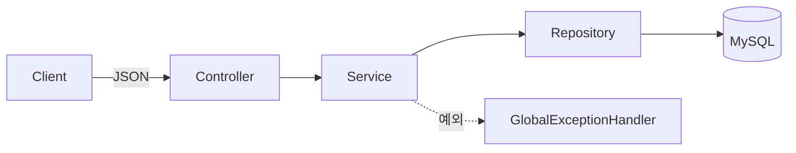
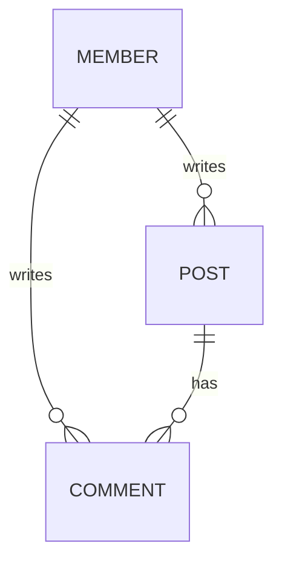

# CRUD 게시판 REST API

회원 / 게시글 / 댓글 CRUD를 구현하는 Spring Boot 학습 프로젝트입니다.
**메모리 저장소로 먼저 구현한 뒤, DB 접근 기술을 단계적으로 교체(메모리 → MyBatis → JPA)** 하며 각 기술의 차이를 학습합니다.

## 기술 스택

| 구분 | 내용 |
|---|---|
| Language | Java 21 |
| Framework | Spring Boot 3.4.5 |
| DB | MySQL 8.0 (Docker) |
| 접근 기술 | MyBatis *(JPA 전환 예정)* |
| Test | JUnit5, AssertJ, RestClient |
| Build | Gradle |

## 아키텍처

**계층별 책임**

| 계층 | 역할 |
|---|---|
| Controller | 요청/응답 처리, `@Valid` 검증 |
| Service | 비즈니스 로직, 작성자 조회 |
| Repository | 데이터 접근 (인터페이스 + MyBatis 구현) |
| GlobalExceptionHandler | 전역 예외 → 일관된 에러 응답 |

> Repository를 인터페이스로 분리해, 구현체만 교체(메모리 → MyBatis → JPA)하면 상위 계층은 그대로 유지됩니다.

## 도메인 관계

- `Member` (1) ─ (N) `Post` ─ (N) `Comment`
- 연관관계는 현재 **id 참조**(`member_id`, `post_id`) → *JPA 전환 시 객체 참조(`@ManyToOne`)로 변경 예정*

## API

| Method | URL | 설명 |
|---|---|---|
| `POST` | `/api/members` | 회원 생성 |
| `GET` | `/api/members` `/{id}` | 회원 목록 / 단건 |
| `POST` | `/api/posts` | 게시글 생성 |
| `GET` | `/api/posts` `/{id}` | 게시글 목록 / 단건 |
| `POST` | `/api/comments` | 댓글 생성 |
| `GET` | `/api/comments` `/{id}` | 댓글 목록 / 단건 |

> 게시글·댓글 응답에는 작성자 이름(`authorName`)이 포함됩니다.

## 설계 포인트

- **DTO 분리** — 요청/응답 DTO를 도메인과 분리, 응답에서 민감 정보(비밀번호) 제외
- **Repository 인터페이스화** — 구현체 교체로 DB 기술 전환 (메모리 → MyBatis → JPA)
- **도메인 불변성** — `@Setter` 대신 생성자·의미 있는 메서드 사용
- **전역 예외 처리** — `@RestControllerAdvice`로 404/400 등 일관된 에러 응답
- **입력 검증** — `@Valid` + Bean Validation
- **계층 책임 분리** — 내부용 도메인 반환 / API용 DTO 반환 구분

## 테스트

| 종류 | 내용 |
|---|---|
| Service 단위 테스트 | 로직 검증 (성공 / 예외 / 연관관계) |
| API 통합 테스트 | `@SpringBootTest(RANDOM_PORT)` + RestClient로 실제 HTTP 검증 |

## 로드맵

**완료**
- [x] REST API (Member / Post / Comment)
- [x] 전역 예외 처리 · 입력 검증
- [x] 단위 · API 통합 테스트
- [x] MySQL (Docker) + MyBatis 전환

**진행 예정**
- [ ] JPA 전환 (연관관계 매핑, 영속성, N+1 → fetch join)
- [ ] QueryDSL (동적 쿼리)
- [ ] 페이징 · 로그인/인증 (JWT)
