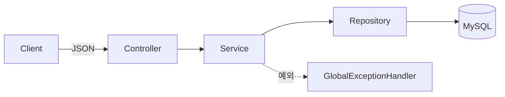
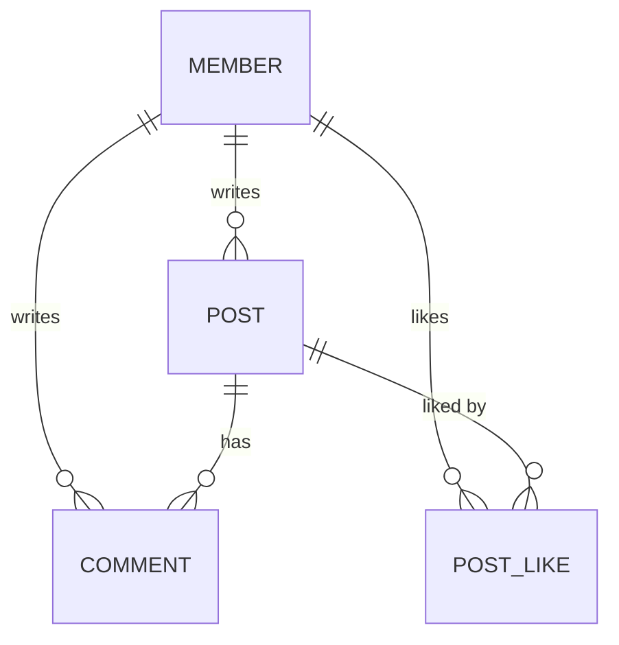

# CRUD 게시판 REST API

회원 / 게시글 / 댓글 CRUD를 구현하는 Spring Boot 학습 프로젝트입니다.
**메모리 저장소로 먼저 구현한 뒤, DB 접근 기술을 단계적으로 교체(메모리 → MyBatis → JPA)** 하며 각 기술의 차이를 학습합니다.

**학습 회고 (velog)**
> - [MyBatis에서 JPA로](https://velog.io/@ochhs0829/MyBatis%EC%97%90%EC%84%9C-JPA%EB%A1%9C-%EB%A7%88%EC%9D%B4%EA%B7%B8%EB%A0%88%EC%9D%B4%EC%85%98)
> - [N+1 문제 실측과 해결](https://velog.io/@ochhs0829/N1-%EB%AC%B8%EC%A0%9C-%EC%8B%A4%EC%B8%A1%EA%B3%BC-%ED%95%B4%EA%B2%B0)
> - [N+1 해결책 트레이드오프](https://velog.io/@ochhs0829/N1-%ED%95%B4%EA%B2%B0%EC%B1%85-%ED%8A%B8%EB%A0%88%EC%9D%B4%EB%93%9C%EC%98%A4%ED%94%84)
> - [게시판에 좋아요 기능 설계해보기](https://velog.io/@ochhs0829/%EA%B2%8C%EC%8B%9C%ED%8C%90%EC%97%90-%EC%A2%8B%EC%95%84%EC%9A%94-%EA%B8%B0%EB%8A%A5-%EC%84%A4%EA%B3%84%ED%95%B4%EB%B3%B4%EA%B8%B0)

## 기술 스택

| 구분 | 내용 |
|---|---|
| Language | Java 21 |
| Framework | Spring Boot 3.4.5 |
| DB | MySQL 8.0 (Docker) |
| 접근 기술 | Spring Data JPA |
| Test | JUnit5, AssertJ, RestClient |
| Build | Gradle |

> MyBatis로 구현했던 버전은 [`mybatis` 브랜치](../../tree/mybatis)에 있습니다.

## 아키텍처

**계층별 책임**

| 계층 | 역할 |
|---|---|
| Controller | 요청/응답 처리, `@Valid` 검증 |
| Service | 비즈니스 로직, `@Transactional`, 작성자 조회 |
| Repository | 데이터 접근 (`JpaRepository`) |
| GlobalExceptionHandler | 전역 예외 → 일관된 에러 응답 |

> Repository를 인터페이스로 분리해, 구현체만 교체(메모리 → MyBatis → JPA)하면 상위 계층은 그대로 유지됩니다.

## 도메인 관계

- `Member` (1) ─ (N) `Post` ─ (N) `Comment`
- `PostLike`는 `Member`·`Post`를 향한 단방향 `@ManyToOne`, `UNIQUE(post_id, member_id)`로 중복 방지
- `@ManyToOne`으로 객체 참조 매핑 (지연로딩)

## API

| Method | URL | 설명 |
|---|---|---|
| `POST` | `/api/members` | 회원 생성 |
| `GET` | `/api/members` `/{id}` | 회원 목록 / 단건 |
| `POST` | `/api/posts` | 게시글 생성 |
| `GET` | `/api/posts` `/{id}` | 게시글 목록 / 단건 |
| `POST` | `/api/comments` | 댓글 생성 |
| `GET` | `/api/comments` `/{id}` | 댓글 목록 / 단건 |
| `POST` | `/api/posts/{postId}/likes` | 게시글 좋아요 |
| `DELETE` | `/api/posts/{postId}/likes` | 게시글 좋아요 취소 |
| `GET` | `/api/posts/{postId}/likes/count` | 게시글 좋아요 수 |

> 게시글·댓글 응답에는 작성자 이름(`authorName`)이 포함됩니다.
> 좋아요 응답에는 갱신된 개수(`likeCount`)와 눌렀는지 여부(`liked`)가 포함됩니다.

## 설계 포인트

- **DTO 분리** — 요청/응답 DTO를 도메인과 분리, 응답에서 민감 정보(비밀번호) 제외
- **Repository 인터페이스화** — 구현체 교체로 DB 기술 전환 (메모리 → MyBatis → JPA)
- **도메인 불변성** — `@Setter` 대신 생성자·의미 있는 메서드 사용
- **전역 예외 처리** — `@RestControllerAdvice`로 404/400 등 일관된 에러 응답
- **입력 검증** — `@Valid` + Bean Validation
- **계층 책임 분리** — 내부용 도메인 반환 / API용 DTO 반환 구분

## 테스트

| 종류 | 내용 |
|---|---|
| Service 단위 테스트 | 로직 검증 (성공 / 예외 / 연관관계) |
| API 통합 테스트 | `@SpringBootTest(RANDOM_PORT)` + RestClient로 실제 HTTP 검증 |

## 로드맵

**완료**
- [x] REST API (Member / Post / Comment)
- [x] 전역 예외 처리 · 입력 검증
- [x] 단위 · API 통합 테스트
- [x] MySQL (Docker) + MyBatis 전환
- [x] JPA 전환 (`@ManyToOne` 연관관계, `@Transactional`)
- [x] N+1 문제 실측 및 해결 (Fetch Join · `@EntityGraph` · Batch Size)
- [x] 게시글 좋아요 (별도 테이블 · 유니크 제약 · COUNT 조회)

**진행 예정**
- [ ] 댓글 좋아요 (`comment_like`) · 중복 좋아요 예외 처리 (500 → 4xx)
- [ ] 조회수 (카운터 · 어뷰징 방지 · 원자적 UPDATE)
- [ ] 카운터 중복 코드 리팩토링 점검
- [ ] 좋아요 · 조회수 비정규화 + 동시성 (COUNT 부담 측정 → 컬럼 저장 → 갱신 유실 → 원자적 UPDATE)
- [ ] 인기글 / 실시간 인기글 (정렬 · 시간 윈도우 집계)
- [ ] 인덱스 최적화 (정렬 · 카운트 쿼리 실행 계획 분석, 복합 · 커버링 인덱스)
- [ ] QueryDSL (동적 쿼리)
- [ ] 페이징
- [ ] 로그인/인증 (JWT)
